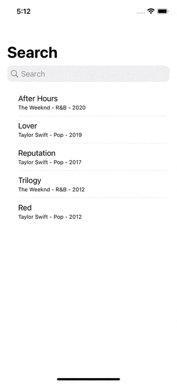

# AlbumSearch

This is a tiny demo-app made with UIKit, implementing the typesense-swift client. The typesense server used is a typesense-cloud instance and I have made the api-key public: this api-key is a search-only key.

